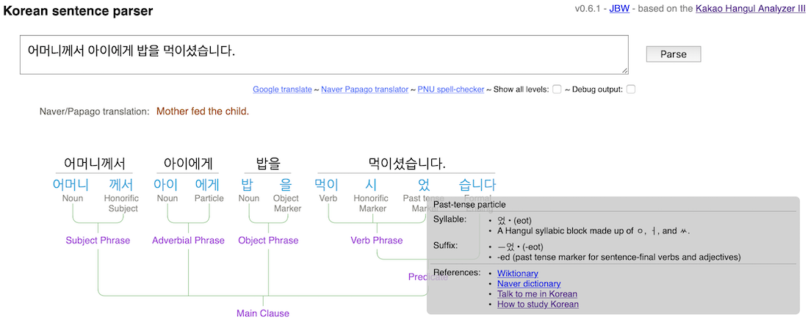

# Korean Sentence Parser
Copyright © John Wainwright, 2019.

The parser implemented in this repo is meant to be
a learning tool for students of 
the Korean language.  It is currently accessible online in development form at [http://hangugeo.org/analyzer](http://hangugeo.org/analyzer). 
It is still very-much a work-in-progress, developed by a non-native-speaking, intermediate-level Korean student as a study aid and so may not give correct or even any parsing for a particular sentence, and may be 
offline at times.

The parser depends on several crucial 3rd-party components, foremost being the [Kakao Hangul Analyzer III](https://github.com/kakao/khaiii) (Khaiii), 
a neural-net-based Korean phoneme analyzer made available by Kakao.  The parser web-app is built using
the [Flask](http://flask.pocoo.org) Python app-server, [Vue JS](https://vuejs.org) for the front-end, and [Webpack](https://webpack.js.org) for 
build-management. 

The main contribution made here is a phrase parser that takes the phonemes and low-level parts-of-speech derived by Khaiii to produce a hierarchical
phrase parse-tree, representing syntactic constructs such as predicates, subject, object & topic phrases, common conjugation and connecting patterns,
an so on.
 In addition, a web-based front-end is included that provides easy access to the parser and attempts to show the parsing in a understeandable graphical form
along with helpful annotations, word definitions, translations and links to various references for the key constructs in a sentence, hopefully
useful to learners of the Korean language. 

### Example UI

Below is screen-shot of the front-end UI and an example sentence-parsing output.  You enter one or more sentences in the text-box at the top 
and hit the ``Parse`` button.  The main output is a parse-tree showing the original words in the sentence in black at the top sitting over the 
lexical phonemes & phoneme-patterns that make up the sentence, in teal.  Under each phoneme is a descriptive part-of-speech and under the
nouns & verbs are English
translations from the Naver/Papago translator public API in orange.  In cases where a word has multiple meanings, the one shown is that which is selected by Naver as its 
default out-of-context meaning for the word.

Descending from that is a putative phrase-structure tree, showing the construction of larger phrases and clauses and the final predicate from
smaller ones.  If you hover the mouse over one of the teal phonemes or phoneme patterns, a gray box pops up showing the definition and any 
information
about it found on [Wiktionary](https://en.wiktionary.org/wiki/Category:Korean_language), along with links to related sections in selected
online references.



#### Parse-tree form
The current parse-tree form, its descriptive labels and other annotations, are a work-in-progress and are an attempt at an explication of Korean
grammar with a decided English bent, for English-speaking learners, and it may be the case that a more formal Korean set of grammatical phrasings & annotations
would be pedagogically preferred.  This is one of the areas of active development and discussion.

Korean, of course, is a language of myriad special connective, conjugational, sentence-ending and other forms; Korean grammar books are mostly filled
not with syntax-rules as you'd find in an English grammar text, but with lists of these patterns, describing their form, the way the should be attached
or applied and the particular meaning or nuance they impart.  The hope is to have this parser detect and show these patterns in the parse-tree.  

The example above shows an instance of this in the predicate, where it has detected the common auxiliary-verb pattern for expressing to-want-to-do
the suffixed verb: **V-고 싶다**.  The parser has isolated that pattern and labeled it appropriately.  A good part of the code at the end of
``backend.tagmap.py``
is a start at a set of pattern-specs that allow the parser to detect these patterns and label them usefully.   The hope is that
this set will be filled out by open-source contributions, along with other improvements that open-sourcing should bring.  


## Build Setup

If needed, install [node.js](https://nodejs.org/) and Python 3.6 or greater either from [here](https://www.python.org/downloads/) or 
as part of the highly-recommended [Anaconda Python distribution](https://www.anaconda.com/download/).  

Clone or download this repo, ``cd`` into its top-level directory and 
run the following pip command to install required Python libraries:
```
# install Python requirements
$ pip3 install -r requirements.txt
```
Download the *Kakao Hangul Analyzer III* from the [kakao/khaiii github page](https://github.com/kakao/khaiii) and 
prepare according to its [build and installation instructions](https://github.com/kakao/khaiii/wiki/빌드-및-설치). 

To install front-end and webpack dependencies, ``cd`` into the ``frontend`` subdirectory and run the following npm command:
``` bash
# install front-end and webpack dependencies
$ npm install
```

## Running the development build

The dev build can be run in two modes:
1. With a statically-built production front-end and the Python-based API server running and listening on port **9000**, serving both the main 
index.html and handling API requests from the front end.
2. WIth a hot-reloading front-end being served on port **8080** and the Python API server handling API calls alone on port **9000**.

In both cases, start the API server in its own shell by ``cd``ing into the top-level directory for this repo and running the api.py module:
```
# start the API dev server
$ python3 backend/api.py
```
You can launch the parser web-app by pointing a browser at [http://localhost:9000/analyzer](http://localhost:9000/analyzer).

Open a separate shell to build & optionally run the front-end.

To statically-build the front-end, ``cd`` into the ``frontend`` subdirectory and run the npm build script:
```
# build for production with minification
$ npm run build
```
To run the hot-reloading development version of the front-end, in the same directory run the npm dev script:

```
# serve with hot reload at localhost:8080
$ npm run dev
```
In this case, point a browser at [http://localhost:8080/analyzer](http://localhost:9000/analyzer) to lauch the parser front end.

## Implementation notes

The main parsing operation is performed by the ``backend.api.parseInput()`` function, mostly called by the handler for 
the front-end's AJAX ``/parse/`` REST API call, also in the ``backend.api`` module.

The parsing process has 4 stages, explained in further detail below:
1. Pass the input string throught the Khaiii morhpeme analyzer to get a list of the individual parts-of-speech it contains
2. Apply a series of mappings to that morpheme list that distinguish and provide more detail about specific morphemes and morhpeme patterns
3. Pass the mapped morpheme list through one of two available phrase parsers to get a nested parse-tree of phrase structures in the input
4. Apply an annotation pass to the parse-tree, adding descriptive detail, definitions, references, re-labelings, and so on for a more
useful display

This parse-tree and various reference tables are returned in JSON form by the /parse/ API call to the front-end JavaScript AJAX call
for processing and display by the Vue js template and methods in ``frontend/src/App.vue``.
 
#### Morpheme analysis

The input string is run through the ``khaiiiAPI.analyze()`` morpheme analyzer function.  This returns a sequence of ``KhaiiiWord`` objects,
one for each word & punctuation symbol in the input string, including sentence-end markers for each sentence it finds in the input string.
These word objects themselves contain a sequence of ``KhaiiiMorph`` morpheme objects, one for each distinct lexical morhpheme in the input word,
separating out things like verb-stems, honorific markers, particles and other basic lexical components making up the word.  The returned
word-sequence is broken into sentences and each sentence is further processed in the following steps.

As an example, consider the following sentence:

>#### 그 작은 소년은 빨리 달렸다.

The Khaiii analyzer returns the breakdown of words in the sentence into one or more lexical phonemes and assigns each a part-of-speech
(POS)
tag, as shown in the table below. Note how it separates transforming and topic particles from their stems and even 'decompresses' common 
conjugation shortenings as it does in the past-tense predicate of that sentence.

|Word   |  Morphemes | POS tag |     |
|:-----:|:---------:|:-------:|-----|
| 그     | 그   | MM |  Determiner  |
| 작은   | 작   | VA  |  Descriptive verb|
|       | 은   | ETM |  Adjective-forming particle |   
| 소년은  | 소년 |  NNG |  General noun |
|       | 은  | JX  |  Topic-marking particle |
| 빨리   | 빨리 | MAG |  Adverb |
| 달렸다  | 달리 | VV  |  Verb  |
|       |었   | EP  | Predicate suffix |
|       | 다  | EF  |  Predicate final |
| .     | .  | SF   |   Sentence final |

(The ``backend.tagmap.py`` module contains a full list of the POS tags that can be emitted by the Khaiii analyzer.)

#### Morpheme mapping and common pattern-detection

The morhpeme analysis performed by the Khaiii neural net generates a set of common morpheme tags and does not distinguish between
specific particles of the same part-of-speech or identify multi-phoneme Korean grammar patterns.  For example, the **"었"** past-tense predicate suffix in the example is 
marked with the
generic predicate-ending tag **"EP"**.  The mapper recognizes this specific morpheme-tag group as a past-tense suffix and replaces the **EP**
tag with a specific custom tag that allows it to be labeled as a past-tense suffix in the parse-tree.

An example of a grammar pattern worth detecting is shown in opening example, where the **V-고 싶다** pattern is recognized and labeled as 
the "want-to" pattern.

The phoneme and POS tags returned from the Khaiii analyzer are formed into a single string of the form 
``"<phoneme>:<POS_tag>;<phoneme>:<POS_tag>..."`` and sent to the tag-mapper, making it easier to build tag-recognition RE patterns that span
multiple phonemes.  So, the above examples is sent as:

```
"그:MM;작:VA;은:ETM;소년:NNG;은:JX;빨리:MAG;달리:VV;었:EP;다:EF;.:SF"
```
and returned in list form as:
``` 
[('그:MM'),
 ('작:VA'),
 ('은:ETM'),
 ('소년:NNG'),
 ('은:TOP_4'),
 ('빨리:MAG'),
 ('달리:VV'),
 ('었:PSX_31'),
 ('다:'EF'),
 ('.':SF')]
```
with the **"은"** re-tagged as **TOP_4**, indicating it is definitely a topic-marking particle, and **"었"** re-tagged as **PSX_31** indicating
it is a specific past-tense conjugating predicate suffix.  These remappings help the parsers described later and link to custom annotations and 
labels and references to be displlayed in the parser front-end.

All the custom-tag mapping and grammar-pattern recognition is driven by specs in the ``backend.tagmap`` module.  Theses specs are defined 
using the ``tm()`` tag-map spec utility function.  An example is shown below:

```
tm( # 기/음 nominalizer
    tagPat=r'(기|음):(ETN|NNG)', repl=r'\1:PNOM',
    basePOS="ETN", posLabel="Nominalizing\nParticle", 
    descr="Suffix transforming a verb into a noun",
    refs={"ttmik": "/lessons/level-2-lesson-19",
          "htsk": "/unit-2-lower-intermediate-korean-grammar/unit-2-lessons-26-33/lesson-29"},
)
```
This function takes several keyword parameters, all of them optional except ``tagPat`` which is a Python re pattern to match the desired
phonemem/tag sequence.  The other parameters specify various mappings and labeling and reference detail for that pattern.  In this example,
recognizing a verb nominalizer suffix as either **"기"** or **"음"** with POS tag **"ETN"** or **"NNG"**, replacing the tag with 
the custom tag **"PNOM"** to distinguish the phoneme as a nominalizer for the phrase parser that will run later in the parsing process.  In
addition, label, descriptive and reference information for the construct is also supplied.  The ``refs`` parameter provides 
pathnames on the Talk To Me In Korean (ttmik) and How to Study Korean (htsk) sites to pages which contain reference material for this 
nominalizer form.

The set of tag-mapping & pattern-detection specs currently in place in ``backend.tagmap`` covers only a small part of Korean grammar.  This 
will be gradually expanded over time and the hope is that open-sourcing will provide a way to crowd-source this expansion.

#### Phrase-structure parsing

The phrase parse-tree graph that appears under the phonemes is derived by a syntax-parsing phase that analyzes the mapped phoneme & POS tag
sequence generated by the prior step.  Two alternate parsers have been developed, the first built on the [NLTK](http://www.nltk.org) Python 
library's "chunking" 
capabilities and is driven by a RegExp-based chunking grammar located in the ``backend.chunker`` module.  Documentation on the 
relevant NLTK components
used is available [here](http://www.nltk.org/book_1ed/ch07.html) and [here](http://www.nltk.org/api/nltk.chunk.html#module-nltk.chunk).  

The second parser is a so-called ad-hoc,
recursive-descent parser, hand-coded in Python, and is the parser currently in use by the parser hosted on hangugeo.org.   

The NTLK chunking grammar is certainly simpler and more declarative than the r-d parser, but as chunking grammars get large and recursive, 
controlling parsing sequencing
becomes very challenging.  It's other main advantage is that it will always give a parsing of some kind, leaving phoneme sequences it doesn't
understand just as singleton words in the resulting parse-tree.

The recursive-descent parser provides precise control over sequencing and has sophisticated back-tracking so it tries to match all possible
parsings and then pick the ones that look most-complete.  Being ad-hoc allows for custom logic and context-sensitive parsing in any rule, 
which is almost-certainly going to be needed in a complete Korean parser.  It is currently more complete than the NTLK chunking grammar
but has the downside that it will fail to give any parse-tree at all if the sequence of phonemes it is given are not recognized
by the grammar rules that it currently has.
 
The grammar rules are located in the ``backend.rd_grammar`` module.  They are in the form of methods on the ``KoreanParser`` class marked 
with the
``@grammar_rule`` decorator.  The associated ``backend.rd_parser`` contains a lexical-analyzer, ParseTree class for holding the resultant 
parsing, and a series of helper functions used to build the grammar-rule methods.

Here are the first couple of rules:

```
    @grammarRule
    def sentence(self):
        "parses top-level sentence"
        s = sequence(zeroOrMore(self.subordinateClause), 
                     self.mainClause())
        return s

    @grammarRule
    def subordinateClause(self):
        "subordinate clause"
        sc = sequence(zeroOrMore(self.phrase),
                      self.verbPhrase(),
                      self.connectingSuffix(),
                      optional(self.punctuation))
        return sc

    @grammarRule
    def mainClause(self):
        "main clause"
        mc = sequence(zeroOrMore(self.phrase), 
                      self.predicate())
        return mc

    @grammarRule
    def predicate(self):
        "predicate"
        p = sequence(self.verbPhrase(), 
                     self.endingSuffix())
        return p

    @grammarRule
    def phrase(self):
        "parse a phrase"
        p = sequence(anyOneOf(option(self.nounPhrase),
                              option(self.objectPhrase),
                              option(self.subjectPhrase),
                              option(self.topicPhrase),
                              option(self.adverbialPhrase),
                              option(self.complementPhrase)),
                     zeroOrMore(self.interjection),
                     ))
        return p
```
These enocode the equivalent [EBNF](https://en.wikipedia.org/wiki/Extended_Backus–Naur_form) grammar:

```
sentence           ::= { subordinateClause } mainClause
subordinateClause  ::= { phrase } verbPhrase CONNECTING_SUFFIX [ PUNCTUATION ]
mainClause         ::= { phrase } predicate
predicate          ::= verbPhrase ENDING_SUFFIX
phrase             ::= ( nounPhrase | objectPhrase | subjectPhrase | topicPhrase | adverbialPhrase | complementPhrase ) { INTERJECTION }
```

The grammar-rule methods make heavy use of the grammar-helper functions ``sequence``, ``zeroOrMore``, ``optional`` and ``anyOneOf``,
all imported from ``backend.ed_parser``.
There are specific usage rules for these helper functions regarding argument forms, see the comments in each of the helper-function
definitions.  

Perhaps the key attributes of this parser are that it will eagerly match all options in an ``anyOneOf`` rule component and
pick the longest match, and it will match along ``sequence`` rules, back-tracking and retrying on failures as it explores all possible
combinations implied by optional components in the sequence.

The terminal tokens in the grammar are the ``phoneme:tag`` tuples returned by the tag-mapping phase.  A rule in the grammar would use 
the lexical analyzer ``next()`` or ``peek()`` or ``backtrack()`` methods to test for and navigate the ``phoneme:tag`` token sequence.  For example:

```
    @grammarRule
    def number(self):
        return self.lexer.next(r'.*:(MM|NUM.*|SN)')
```
uses the lexer's next() method giving it a ``phoneme:tag`` Python RE expression to match the next token, in this case taking any phoneme (``.*``) and 
any of the tags ``MM``, ``NUM.*`` or ``SN`` to match a number terminal.

#### State of the grammar
The current R-D grammar is certainly incomplete and almost-certainly wrong is several ways, being developed to date by 
a non-native, intermediate-level Korean language student.  The hope is that open-source contributors with much more extensive Korean experience will help refine & extend the grammar, and add to the common-pattern recognizers & 
reference material in the tag-mapper.

#### Web UI
The webapp front-end to the parser is a simple single-page app, implemented on the [Vue JS](https://vuejs.org) Javascript framework.  It
uses a REST-like API, implemented on the [Flask](http://flask.pocoo.org) server framework, to access the parser back-end.

The Flask server and HTTP request handlers are in ``backend.api``.
The main page ``index.html`` lives in the ``frontend`` directory and is a typical Vue JS skeleton index.html.
The SPA is a single Vue template component ``KoreanParser`` defined in ``frontend/src/KoreanParser.vue`` with the top-level Vue
Javascript in ``frontend/src/main.js``.

When the Vue SPA is built with ``npm run build`` or ``npm run dev`` as described in the build sections above, distribution versions 
of the generated HTML & Javascript are placed in the top-level ``dist`` directory and served from there as static files by the Flask server.

The main parser UI page is served by the Flask server in response to a ``/analyzer`` HTTP request.  The Vue JS client-side runtime constructs the 
builk of the UI from the templates & Javascript in ``frontend/src/KoreanParser.vue``.  When the ``Parse`` button is pressed, the entered
sentence is sent via HTTP POST to the ``/parse/`` request-handler in ``backend.api`` and invokes the parsing phases described above.
The resultant parse-tree and other supporting material is returned in a JSON object to the JavaScript in the Vue code, which interprets
it to build the final output displays as dynamically-generated HTML and SVG elements.

Some of the Javascript code constructing the parsing display is tricky and I will write more on that soon.
